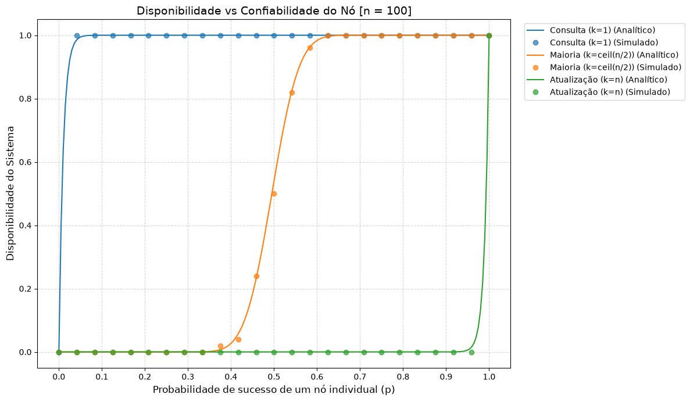
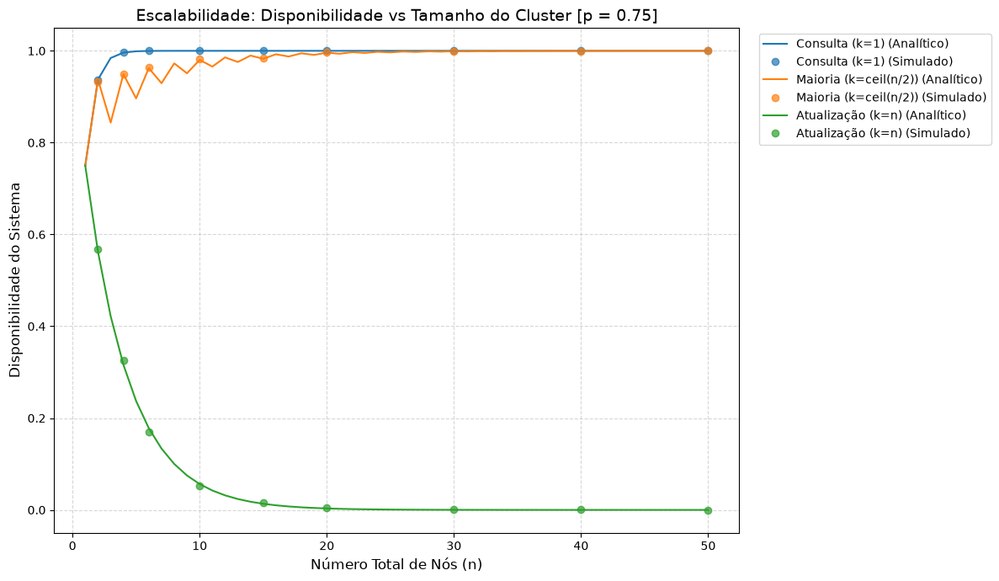
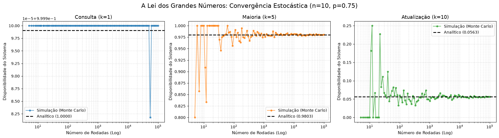

# Computação Distribuída - Resolução dos Exercícios I (1.1 e 1.2)

**Instituição:** Universidade de Fortaleza (UNIFOR)  
**Aluna:** Amanda Lira Andrade Botelho  

Este repositório contém a resolução das atividades 1.1 e 1.2 da lista "Exercícios I" da disciplina de Computação Distribuída. A solução computacional, incluindo o simulador estocástico, geração de tabelas e visualização de gráficos, foi desenvolvida inteiramente em Python utilizando um Jupyter Notebook.

---

## 📁 Estrutura do Projeto

| Arquivo | Descrição |
| :--- | :--- |
| `resolucao_exercicios.ipynb` | Arquivo principal contendo as implementações em Python, o cálculo analítico, o simulador estocástico e a geração dos gráficos 2D. |
| `requirements.txt` | Lista de dependências do Python (bibliotecas) necessárias para executar o projeto. |
| `README.md` | Documentação principal com as instruções de execução e a dedução teórica do Exercício 1.1. |

---

## 🚀 Como Rodar o Projeto

Para executar o notebook e reproduzir as simulações e gráficos localmente, certifique-se de ter o Python instalado na sua máquina e siga os passos abaixo:

1. **Crie um ambiente virtual (recomendado):**
   ```bash
   python -m venv .venv
   ```

2. **Ative o ambiente virtual:**
   * No Windows:
     ```bash
     .venv\Scripts\activate
     ```
   * No Linux/Mac:
     ```bash
     source .venv/bin/activate
     ```

3. **Instale as dependências:**
   Crie um arquivo `requirements.txt` com o conteúdo `numpy pandas matplotlib jupyter` e rode:
   ```bash
   pip install -r requirements.txt
   ```

4. **Inicie o Jupyter Notebook:**
   ```bash
   jupyter notebook resolucao_exercicios.ipynb
   ```
   *Você também pode abrir e rodar o arquivo `.ipynb` diretamente através de editores como VS Code.*

---

## 📝 Exercício 1.1: Dedução Analítica da Disponibilidade

O objetivo da função é calcular matematicamente a disponibilidade de um serviço com base na falha independente das máquinas que compõe o sistema sendo:
- $n$ = número total de servidores no sistema
- $k$ = a quantidade mínima de servidores que deve estar ativa simultaneamente para o sistema funcionar
- $p$ = probabilidade individual do funcionamento de cada servidor

### 1. Obtendo a fórmula

#### Disponibilidade independente de cada servidor

Cada um dos servidores no sistema pode ter apenas um de dois estados, disponível e indisponível, sendo a probabilidade dele estar disponível $p$, logo temos para cada um deles a probabilidade de estar indisponível como $(1 - p)$.

#### Probabilidade de cenário específico

Se quisermos analisar a probabilidade de um caso específico onde temos $i$ servidores online, enquanto o restante $(n - i)$ está offline, obtemos essa probabilidade com $p^i (1 - p)^{n - i}$. É aplicada a probabilidade de se estar disponível para todos os servidores que queremos disponíveis no caso ($p^i$) e multiplicada pela probabilidade de indisponibilidade para todos aqueles que estariam indisponíveis no caso ($(1 - p)^{n - i}$).

### Combinações

Como os $i$ servidores podem ser quaisquer uns dentro de $n$, para considerar todas as combinações de quem está online, multiplicamos a probabilidade pelo coeficiente binomial $\binom{n}{i}$.

### Pelo menos $k$ servidores

Como estamos trabalhando com pelo menos $k$ servidores disponíveis, não podemos analisar somente o caso exato onde $i = k$, mas também todos os cenários subsequentes até $n$. Assim, é necessário fazer o somatório das probabilidades de todos esses cenários, obtendo a equação geral:

$$A(n, k, p) = \sum_{i=k}^{n} \binom{n}{i} p^i (1-p)^{n-i}$$

### 2. Dedução dos Casos Extremos

Para simplificar a análise do comportamento do sistema, derivamos as fórmulas para os dois cenários extremos solicitados pelo problema:

* **Operação de Atualização ($k = n$): Maioria Máxima**
  Neste cenário, o serviço exige que **todos** os $n$ servidores estejam operantes simultaneamente. Aplicando $k = n$ na fórmula geral, temos apenas um termo na somatória onde $i = n$:
  $$A_{k=n} = \binom{n}{n} p^n (1-p)^0$$
  Como $\binom{n}{n} = 1$ e $(1-p)^0 = 1$, a fórmula se reduz à probabilidade conjunta de todos os eventos independentes:
  $$A_{k=n} = p^n$$

* **Operação de Consulta ($k = 1$): Maioria Mínima**
  Aqui, o serviço funciona se **pelo menos um** servidor estiver online. Em vez de somar as probabilidades de $i=1$ até $i=n$, é matematicamente mais eficiente utilizar a regra do evento complementar: calcular a probabilidade de o serviço falhar completamente (zero servidores disponíveis, $i=0$) e subtrair de $1$.
  A probabilidade de todos os $n$ servidores falharem simultaneamente é:
  $$P(X = 0) = (1-p)^n$$
  Portanto, a disponibilidade garantida por pelo menos um servidor é o complemento dessa falha total:
  $$A_{k=1} = 1 - (1-p)^n$$

---

## 📊 Exercício 1.2: Cálculo Analítico vs. Simulação Estocástica

A implementação do Exercício 1.2 encontra-se detalhada no arquivo da solução `resolucao_exercicios.ipynb`. O desenvolvimento computacional foi segmentado em duas abordagens:

1. **Cálculo Analítico (`disp_analitica`):** Implementação direta da fórmula binomial deduzida no Exercício 1.1. Utiliza a função `math.comb` do Python para calcular a probabilidade exata da disponibilidade teórica, realizando o somatório das chances de termos de $k$ a $n$ nós operantes.
2. **Simulador Estocástico (`disp_simulada`):** Implementação baseada no método de Monte Carlo.

O desenvolvimento computacional foi estruturado em três experimentos isolados, desenhados para avaliar o comportamento do sistema sob diferentes perspectivas matemáticas e validar a exatidão do simulador estocástico em relação à teoria.

### Experimento 1: O Impacto da Confiabilidade Individual ($p$)



Este experimento fixou o tamanho do cluster em $n=100$ nós e variou a probabilidade de sucesso individual no eixo X.
- **Consulta (k=1)**: A disponibilidade do sistema atinge o patamar de 1.0 rapidamente, mesmo para valores muito baixos de probabilidade individual.
- **Maioria (k=ceil(n/2))**: A curva demonstra a Lei dos Grandes Números ao formar um degrau íngreme. O sistema transita de uma disponibilidade quase nula para 1.0 a partir do momento em que a confiabilidade do nó cruza a marca de 0.5 no eixo X.
- **Atualização (k=n)**: A linha permanece em 0.0 na maior parte do gráfico. O sistema só começa a apresentar disponibilidade quando a probabilidade de sucesso do nó individual atinge valores muito próximos a 1.0.
- **Validação**: Os pontos representando a simulação estocástica alinham-se perfeitamente sobre as curvas contínuas do modelo analítico em todas as três regras.

### Experimento 2: Escalabilidade do Sistema ($n$)



Nesta análise, a probabilidade individual foi fixada em $p=0.75$, enquanto o tamanho do cluster ($n$) variou no eixo X.
- **Consulta (k=1)**: A curva alcança e se mantém em 1.0 com a adição de poucos nós ao sistema.
- **Maioria (k=ceil(n/2))**: O gráfico apresenta uma fase inicial de oscilação em formato serrilhado. Após os nós iniciais, a curva estabiliza-se e converge de forma suave para uma disponibilidade próxima de 1.0.
- **Atualização (k=n)**: A disponibilidade exibe um decaimento exponencial, caindo rapidamente em direção a zero à medida que o número total de nós aumenta até 50.
- **Validação**: Os marcadores circulares do modelo simulado acompanham com exatidão a trajetória das linhas analíticas correspondentes.

### Experimento 3: A Lei dos Grandes Números (Convergência Estocástica)



O último experimento fixou o ambiente com $n=10$ e $p=0.75$, apresentando três subgráficos para avaliar as diferentes regras de $k$ ao longo de um número crescente de rodadas em escala logarítmica.
- **Valores Analíticos**: O cálculo exato estabeleceu linhas de referência tracejadas horizontais, sendo 1.0000 para Consulta ($k=1$), 0.9803 para Maioria ($k=5$) e 0.0563 para Atualização ($k=10$).
- **Oscilação Inicial**: No lado esquerdo dos gráficos, onde o número de rodadas é baixo, a frequência experimental oscila consideravelmente. No cenário de Maioria ($k=5$), o valor simulado varia abruptamente entre 0.800 e 1.000. No cenário de Atualização ($k=10$), a simulação inicia em 0.00, salta para 0.25 e continua variando.
- **Convergência Final**: Conforme o eixo X progride em direção a $10^5$ rodadas, a oscilação das linhas sólidas (simulação) desaparece. A frequência estocástica converge de maneira exata para sobrepor a linha analítica em todos os cenários, comprovando a eficácia do método de Monte Carlo com um alto volume de iterações.